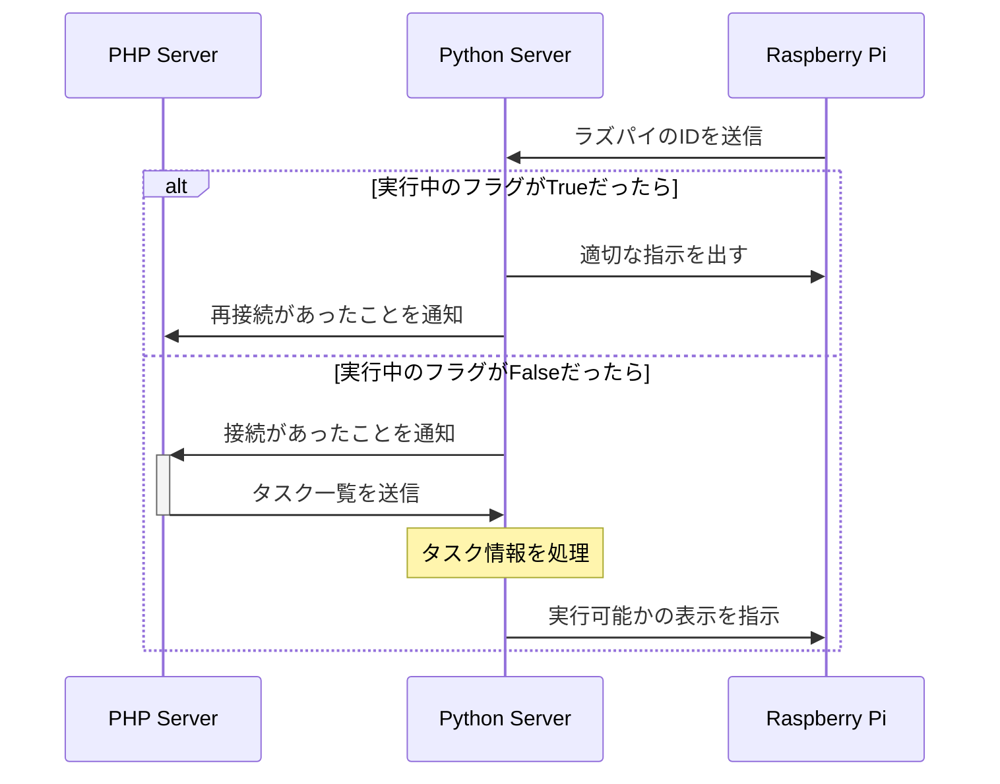
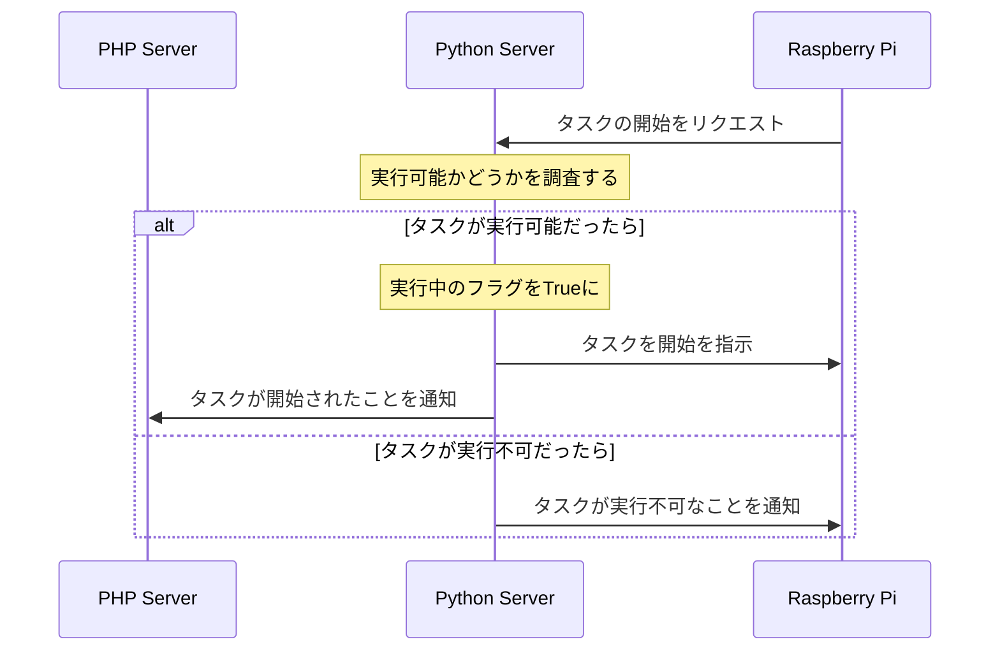
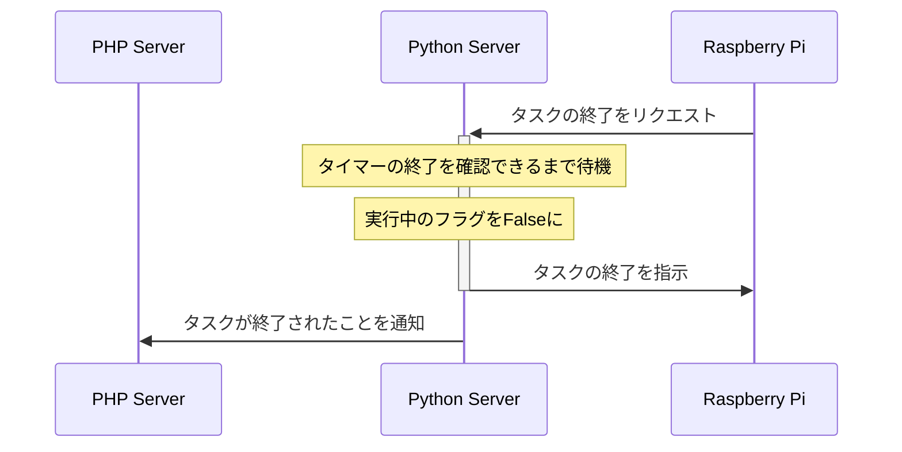
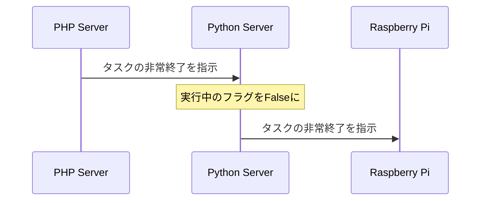
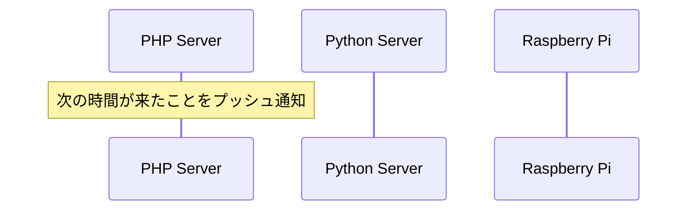

# シーケンス図

## ラズパイの電源が入った時

```mermaid
sequenceDiagram
    participant server as PHP Server
    participant python as Python Server
    participant client as Raspberry Pi

    client ->> python: ラズパイのIDを送信
    alt 実行中のフラグがTrueだったら
        python ->> client: 適切な指示を出す
        python ->> server: 再接続があったことを通知
    else 実行中のフラグがFalseだったら
        python ->>+ server: 接続があったことを通知
        server ->>- python: タスク一覧を送信
        Note over python: タスク情報を処理
        python ->> client: 実行可能かの表示を指示
    end
```

## ラズパイのボタンが押された時

```mermaid
sequenceDiagram
    participant server as PHP Server
    participant python as Python Server
    participant client as Raspberry Pi

    client ->> python: タスクの開始をリクエスト
    Note over python: 実行可能かどうかを調査する
    alt タスクが実行可能だったら
        Note over python: 実行中のフラグをTrueに
        python ->> client: タスクを開始を指示
        python ->> server: タスクが開始されたことを通知
    else タスクが実行不可だったら
        python ->> client: タスクが実行不可なことを通知
    end
```

## ラズパイのタイマーが終了した時

```mermaid
sequenceDiagram
    participant server as PHP Server
    participant python as Python Server
    participant client as Raspberry Pi

    client ->>+ python: タスクの終了をリクエスト
    Note over python: タイマーの終了を確認できるまで待機
    Note over python: 実行中のフラグをFalseに
    python ->>- client: タスクの終了を指示
    python ->> server: タスクが終了されたことを通知
```

## Web側から非常終了をする時

```mermaid
sequenceDiagram
    participant server as PHP Server
    participant python as Python Server
    participant client as Raspberry Pi

    server ->> python: タスクの非常終了を指示
    Note over python: 実行中のフラグをFalseに
    python ->> client: タスクの非常終了を指示
```

## 次のタスクの時間が来た時

```mermaid
sequenceDiagram
    participant server as PHP Server
    participant python as Python Server
    participant client as Raspberry Pi

    Note over server: 次の時間が来たことをプッシュ通知
```
